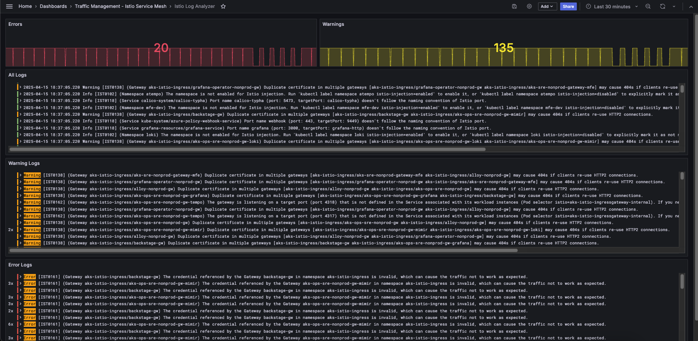

# Istio Analyzer Exporter

## About
Istio-Analyzer-Exporter helps to ensure that your Istio Service Mesh is correct configured and coming up through the Grafana Dashboards.

## How does it work?
Istio-Analyzer-Exporter tool collects, processs and forward logs to a logging management tool. The version v1.0.0 uses Grafana Loki as logging management tool.

Istio-Analyzer-Exporter works with "istioctl" who is a configuration command line utility that allows service operators to debug and diagnose their Istio service mesh deployments.


### Istio Analyzer Dashboard  




## How to deploy
````
kubectl apply -f istio-analyzer-exporter.yaml
```


### References:
https://istio.io/latest/docs/reference/commands/istioctl/  
https://istio.io/latest/docs/reference/commands/istioctl/#istioctl-analyze  
https://istio.io/latest/docs/ops/diagnostic-tools/istioctl/  
