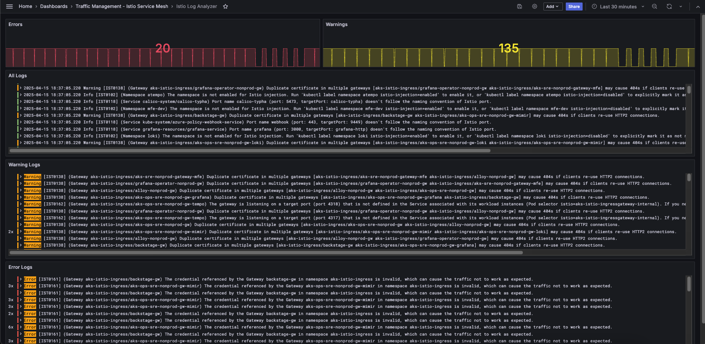

# Istio Analyzer Exporter

## About
Istio-Analyzer-Exporter helps to ensure that the Istio Service Mesh is configured correctly by providing analytics collected to a logging management tool, which can then be presented in a Grafana dashboard.

## How does it work?
The Istio-Analyzer-Exporter tool collects, processes, and forwards logs to a logging management tool. Version **v1* uses **Grafana Loki** as the logging management tool. 

It works alongside **`istioctl`**, a configuration command-line utility that allows service operators to debug and diagnose their Istio service mesh deployments.

---

### Istio Analyzer Dashboard  

  
*Example of the Grafana dashboard displaying Istio analytics.*

---

## How to Deploy
Set the CLUSTER_NAME and LOGGING_TOOL_URL environment variables in the istio-analyzer-exporter.yaml file.

```yaml
        env:
        - name: CLUSTER_NAME
          value: "k8s-dev01"
        - name: LOGGING_TOOL_URL
          value: "http://loki.example.com/loki/api/v1/push"
```

Then deploy it using the following command:

```bash
kubectl apply -f istio-analyzer-exporter.yaml -n istio-system
```


## Error and Warning Samples
Below are examples of errors and warnings that Istio-Analyzer-Exporter can help identify and resolve:

- **Error [IST0161]:**  
  *(Gateway aks-istio-ingress/backstage-gw)*  
  The credential referenced by the Gateway `backstage-gw` in namespace `aks-istio-ingress` is invalid, which can cause the traffic not to work as expected.

- **Warning [IST0138]:**  
  *(Gateway aks-istio-ingress/aks-sre-nonprod-gateway-mfe)*  
  Duplicate certificate in multiple gateways (`aks-istio-ingress/aks-sre-nonprod-gateway-mfe` and `aks-istio-ingress/alloy-nonprod-gw`) may cause 404s if clients re-use HTTP2 connections.

---

## References
For more information, refer to the official Istio documentation:

- [Istioctl Commands](https://istio.io/latest/docs/reference/commands/istioctl/)  
- [Istioctl Analyze](https://istio.io/latest/docs/reference/commands/istioctl/#istioctl-analyze)  
- [Istio Diagnostic Tools](https://istio.io/latest/docs/ops/diagnostic-tools/istioctl/)  

---

## Contributors
If you'd like to contribute, please feel free to submit a pull request or open an issue or feel free to reach out if you have suggestions for improvement!

---

## License
This project is licensed under the **MIT License**. See the [LICENSE](LICENSE) file for details.

---

## Additional Resources
- **Grafana Loki Documentation:** [https://grafana.com/docs/loki/latest/](https://grafana.com/docs/loki/latest/)  
- **Istio Service Mesh Overview:** [https://istio.io/](https://istio.io/)  

---

