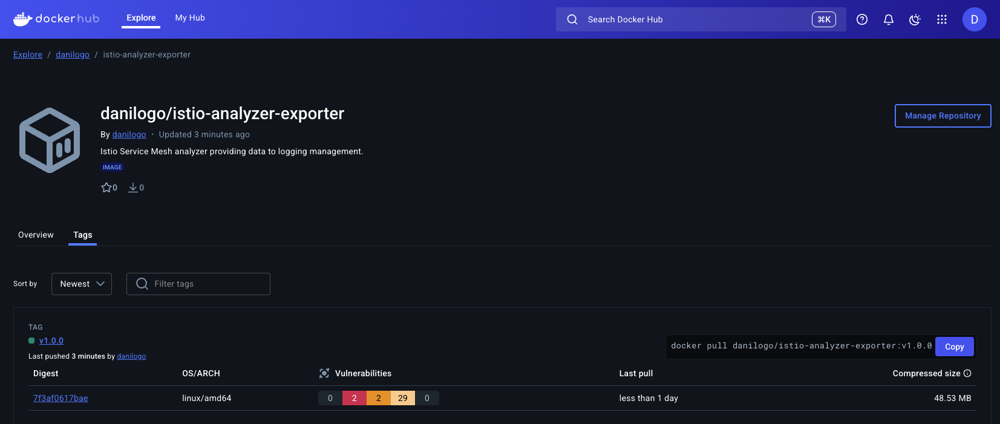
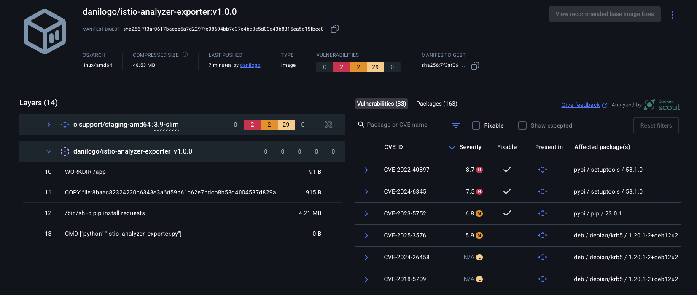
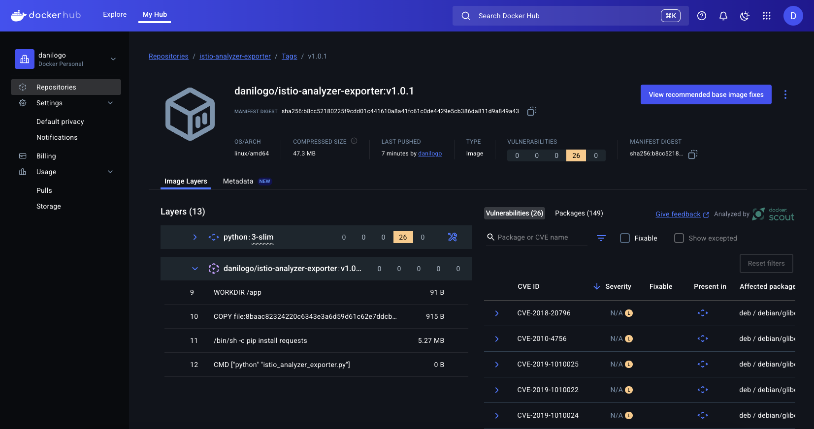
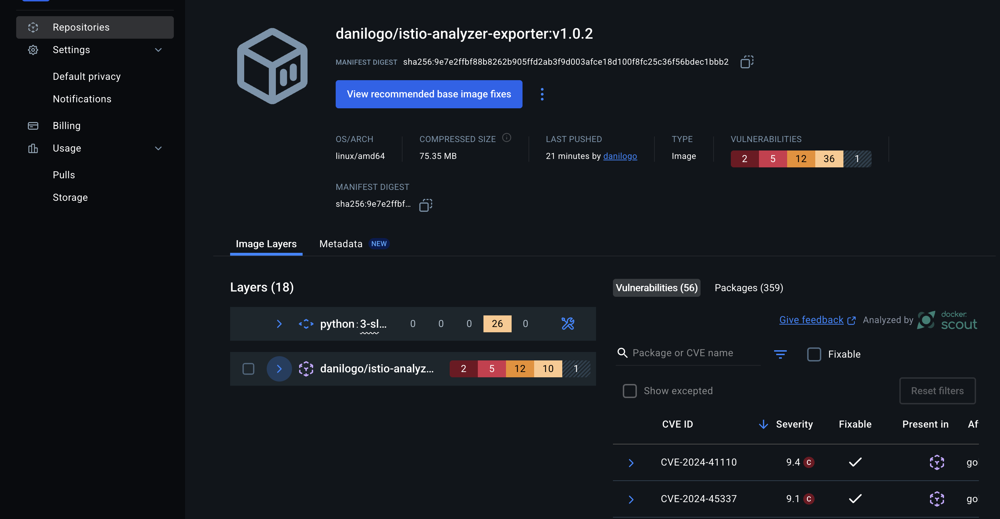

# Security Policy

## Supported Versions

We actively support the following versions with security updates:

| Version | Supported          |
|---------|--------------------|
| x.y.z   | :white_check_mark: |
| a.b.c   | :x:                |

## Reporting a Vulnerability

If you discover a security vulnerability, please report it responsibly. Follow these steps:

1. **Do not disclose publicly**: Avoid sharing details of the vulnerability in public forums or repositories.
2. **Contact us**: Send an email to [security@example.com](mailto:security@example.com) with the following details:
    - A detailed description of the vulnerability.
    - Steps to reproduce the issue.
    - Any potential impact or exploit scenarios.
3. **Response time**: We aim to acknowledge receipt of your report within 48 hours and provide a resolution timeline.

## Security Best Practices

To prevent vulnerabilities, we adhere to the following practices:

- **Code Reviews**: All code changes are reviewed by multiple team members.
- **Dependency Management**: Regularly update dependencies to patch known vulnerabilities.
- **Static Analysis**: Use automated tools to detect security issues in the codebase.
- **Access Control**: Enforce least privilege principles for all systems and services.
- **Monitoring**: Continuously monitor for suspicious activity and potential threats.

## Additional Resources

- [OWASP Top Ten](https://owasp.org/www-project-top-ten/)
- [CWE Common Weakness Enumeration](https://cwe.mitre.org/)

By following these guidelines, we aim to maintain a secure and robust system.  

Vulnerabilites

references:
Pythom image: https://hub.docker.com/_/python

CHANGED Image version

istioctl version issues

